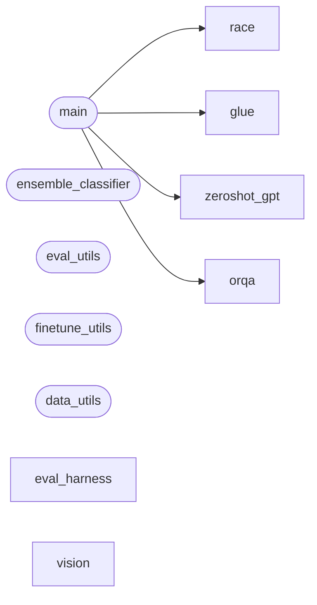

# Code Overview

[_Documentation generated by Documatic_](https://www.documatic.com)

<!---Documatic-section-Codebase Structure Python-start--->
## Codebase Structure Python

The codebase has a 2-deep folder structure,
                with 26 code files in total.

<!---Documatic-block-system_architecture-start--->

<!---Documatic-block-system_architecture-end--->

# #
<!---Documatic-section-Codebase Structure Python-end--->

<!---Documatic-section-Important Functions-start--->
## Important Functions

<!---Documatic-block-important_funcs-start--->
<!---Documatic-block-most_used_funcs-start--->
### Most Utilised Functions

* [tasks.race.finetune.main](4-tasks_race.md#tasks.race.finetune.main) (1 times)
* [tasks.glue.finetune.main](5-tasks_glue.md#tasks.glue.finetune.main) (1 times)
* tasks.zeroshot_gpt.evaluate.main (1 times)
* [tasks.orqa.evaluate_orqa.main](6-tasks_orqa.md#tasks.orqa.evaluate_orqa.main) (1 times)
<!---Documatic-block-most_used_funcs-end--->
<!---Documatic-block-important_funcs-end--->

# #
<!---Documatic-section-Important Functions-end--->

<!---Documatic-section-File IO-start--->
## File IO

<!---Documatic-block-file_io-start--->
The following files have file read operations

<!---Documatic-block-tasks.eval_harness-start--->

	
<code>tasks.eval_harness</code> (Click to Expand!)

* tasks.eval_harness.report-to-csv

<!---Documatic-block-tasks.eval_harness-end--->

<!---Documatic-block-tasks.glue-start--->

	
<code>tasks.glue</code> (Click to Expand!)

* tasks.glue.mnli
* tasks.glue.qqp

<!---Documatic-block-tasks.glue-end--->

<!---Documatic-block-tasks.orqa-start--->

	
<code>tasks.orqa</code> (Click to Expand!)

* tasks.orqa.natural_questions.nq

<!---Documatic-block-tasks.orqa-end--->

<!---Documatic-block-tasks.race-start--->

	
<code>tasks.race</code> (Click to Expand!)

* tasks.race.data

<!---Documatic-block-tasks.race-end--->

<!---Documatic-block-tasks.zeroshot_gpt-start--->

	
<code>tasks.zeroshot_gpt</code> (Click to Expand!)

* tasks.zeroshot_gpt.datasets

<!---Documatic-block-tasks.zeroshot_gpt-end--->

The following files have file write operations

<!---Documatic-block-tasks-start--->

	
<code>tasks</code> (Click to Expand!)

* tasks.ensemble_classifier

<!---Documatic-block-tasks-end--->

<!---Documatic-block-tasks.eval_harness-start--->

	
<code>tasks.eval_harness</code> (Click to Expand!)

* tasks.eval_harness.evaluate
* tasks.eval_harness.report-to-csv

<!---Documatic-block-tasks.eval_harness-end--->
<!---Documatic-block-file_io-end--->

# #
<!---Documatic-section-File IO-end--->

<!---Documatic-section-Class Hierarchy-start--->
## Class Hierarchy

<!---Documatic-block-ABC-start--->

	
<code>ABC</code> (Click to Expand!)

* tasks.glue.data.GLUEAbstractDataset
* tasks.orqa.natural_questions.nq.NQDataset

<!---Documatic-block-ABC-end--->

<!---Documatic-block-object-start--->

	
<code>object</code> (Click to Expand!)

* tasks.orqa.evaluate_utils.ORQAEvaluator

<!---Documatic-block-object-end--->

<!---Documatic-block-tasks.glue.data.GLUEAbstractDataset-start--->

	
<code>tasks.glue.data.GLUEAbstractDataset</code> (Click to Expand!)

* tasks.glue.mnli.MNLIDataset
* tasks.glue.qqp.QQPDataset

<!---Documatic-block-tasks.glue.data.GLUEAbstractDataset-end--->

<!---Documatic-block-tasks.orqa.natural_questions.nq.CustomDataLoader-start--->

	
<code>tasks.orqa.natural_questions.nq.CustomDataLoader</code> (Click to Expand!)

* tasks.orqa.natural_questions.nq.CustomDataLoader

<!---Documatic-block-tasks.orqa.natural_questions.nq.CustomDataLoader-end--->

<!---Documatic-block-tasks.orqa.natural_questions.tokenizers.SimpleTokenizer-start--->

	
<code>tasks.orqa.natural_questions.tokenizers.SimpleTokenizer</code> (Click to Expand!)

* tasks.orqa.natural_questions.tokenizers.SimpleTokenizer
* tasks.orqa.natural_questions.tokenizers.SpacyTokenizer

<!---Documatic-block-tasks.orqa.natural_questions.tokenizers.SimpleTokenizer-end--->

<!---Documatic-block-tasks.zeroshot_gpt.datasets._LMDataset-start--->

	
<code>tasks.zeroshot_gpt.datasets._LMDataset</code> (Click to Expand!)

* tasks.glue.data.GLUEAbstractDataset
* tasks.orqa.natural_questions.nq.NQDataset
* tasks.race.data.RaceDataset

<!---Documatic-block-tasks.zeroshot_gpt.datasets._LMDataset-end--->

<!---Documatic-block-torch.utils.data.Dataset-start--->

	
<code>torch.utils.data.Dataset</code> (Click to Expand!)

* tasks.zeroshot_gpt.datasets._LMDataset
* tasks.zeroshot_gpt.datasets._LambadaDataset

<!---Documatic-block-torch.utils.data.Dataset-end--->

# #
<!---Documatic-section-Class Hierarchy-end--->

[_Documentation generated by Documatic_](https://www.documatic.com)