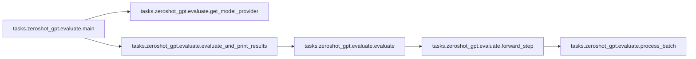
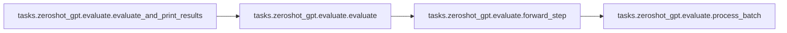

# Tasks Zeroshot Gpt

[_Documentation generated by Documatic_](https://www.documatic.com)

<!---Documatic-section-Codebase Structure-start--->
## Codebase Structure

<!---Documatic-block-system_architecture-start--->
```mermaid
None
```
<!---Documatic-block-system_architecture-end--->

# #
<!---Documatic-section-Codebase Structure-end--->

<!---Documatic-section-tasks.zeroshot_gpt.evaluate.main-start--->
## tasks.zeroshot_gpt.evaluate.main

<!---Documatic-section-main-start--->


### Object Calls

* tasks.zeroshot_gpt.evaluate.get_model_provider
* tasks.zeroshot_gpt.evaluate.evaluate_and_print_results

<!---Documatic-block-tasks.zeroshot_gpt.evaluate.main-start--->
<details>
	<summary><code>tasks.zeroshot_gpt.evaluate.main</code> code snippet</summary>

```python
def main():
    args = get_args()
    if args.num_layers_per_virtual_pipeline_stage is not None:
        print('Interleaved pipeline schedule is not yet supported for text generation.')
        exit()
    if args.task == 'LAMBADA':
        eval_metric = 'accuracy'
    elif args.task == 'WIKITEXT103':
        eval_metric = 'loss'
    else:
        raise NotImplementedError('{} task is not implemented.'.format(args.task))
    model = get_model(get_model_provider(eval_metric))
    if args.load is not None:
        _ = load_checkpoint(model, None, None)
    assert len(model) == 1, 'Above condition should have caught this'
    model = model[0]
    dataset = build_dataset(args.task)
    dataloader = build_data_loader(dataset, args.micro_batch_size, args.num_workers, drop_last=False)
    evaluate_and_print_results(args.task, dataloader, model, eval_metric)
    print_rank_0('done :-)')
```
</details>
<!---Documatic-block-tasks.zeroshot_gpt.evaluate.main-end--->
<!---Documatic-section-main-end--->

# #
<!---Documatic-section-tasks.zeroshot_gpt.evaluate.main-end--->

<!---Documatic-section-tasks.zeroshot_gpt.evaluate.get_model_provider-start--->
## tasks.zeroshot_gpt.evaluate.get_model_provider

<!---Documatic-section-get_model_provider-start--->
<!---Documatic-block-tasks.zeroshot_gpt.evaluate.get_model_provider-start--->
<details>
	<summary><code>tasks.zeroshot_gpt.evaluate.get_model_provider</code> code snippet</summary>

```python
def get_model_provider(eval_metric):

    def model_provider(pre_process=True, post_process=True):
        """Build the model."""
        if eval_metric == 'loss':
            parallel_output = True
        elif eval_metric == 'accuracy':
            parallel_output = False
        else:
            raise NotImplementedError('output type for {} evaluation metric is not supported.'.format(eval_metric))
        print_rank_0('building GPT model ...')
        model = GPTModel(num_tokentypes=0, parallel_output=parallel_output, pre_process=pre_process, post_process=post_process)
        return model
    return model_provider
```
</details>
<!---Documatic-block-tasks.zeroshot_gpt.evaluate.get_model_provider-end--->
<!---Documatic-section-get_model_provider-end--->

# #
<!---Documatic-section-tasks.zeroshot_gpt.evaluate.get_model_provider-end--->

<!---Documatic-section-tasks.zeroshot_gpt.evaluate.evaluate_and_print_results-start--->
## tasks.zeroshot_gpt.evaluate.evaluate_and_print_results

<!---Documatic-section-evaluate_and_print_results-start--->


### Object Calls

* tasks.zeroshot_gpt.evaluate.evaluate

<!---Documatic-block-tasks.zeroshot_gpt.evaluate.evaluate_and_print_results-start--->
<details>
	<summary><code>tasks.zeroshot_gpt.evaluate.evaluate_and_print_results</code> code snippet</summary>

```python
def evaluate_and_print_results(task, data_loader, model, eval_metric):
    output = evaluate(data_loader, model, eval_metric)
    string = ' validation results on {} | '.format(task)
    if is_last_rank():
        if eval_metric == 'loss':
            num_tokenized_tokens = data_loader.dataset.num_tokenized_tokens
            num_original_tokens = data_loader.dataset.num_original_tokens
            val_loss = output / (num_tokenized_tokens - 1)
            ppl = math.exp(min(20, val_loss))
            token_ratio = (num_tokenized_tokens - 1) / (num_original_tokens - 1)
            adjusted_ppl = math.exp(min(20, val_loss * token_ratio))
            string += 'avg loss: {:.4E} | '.format(val_loss)
            string += 'ppl: {:.4E} | '.format(ppl)
            string += 'adjusted ppl: {:.4E} | '.format(adjusted_ppl)
            string += 'token ratio: {} |'.format(token_ratio)
        elif eval_metric == 'accuracy':
            num_examples = len(data_loader.dataset)
            acc = output / num_examples
            string += 'number correct: {:.4E} | '.format(output)
            string += 'total examples: {:.4E} | '.format(num_examples)
            string += 'avg accuracy: {:.4E}'.format(acc)
        else:
            raise NotImplementedError('evaluation method for {} metric is not implemented yet.'.format(eval_metric))
        length = len(string) + 1
        print('-' * length)
        print(string)
        print('-' * length)
```
</details>
<!---Documatic-block-tasks.zeroshot_gpt.evaluate.evaluate_and_print_results-end--->
<!---Documatic-section-evaluate_and_print_results-end--->

# #
<!---Documatic-section-tasks.zeroshot_gpt.evaluate.evaluate_and_print_results-end--->

[_Documentation generated by Documatic_](https://www.documatic.com)