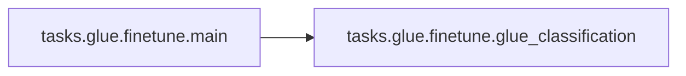

# Tasks Glue

[_Documentation generated by Documatic_](https://www.documatic.com)

<!---Documatic-section-Codebase Structure-start--->
## Codebase Structure

<!---Documatic-block-system_architecture-start--->
```mermaid
None
```
<!---Documatic-block-system_architecture-end--->

# #
<!---Documatic-section-Codebase Structure-end--->

<!---Documatic-section-tasks.glue.finetune.main-start--->
## [tasks.glue.finetune.main](5-tasks_glue.md#tasks.glue.finetune.main)

<!---Documatic-section-main-start--->


### Object Calls

* [tasks.glue.finetune.glue_classification](5-tasks_glue.md#tasks.glue.finetune.glue_classification)

<!---Documatic-block-tasks.glue.finetune.main-start--->
<details>
	<summary><code>tasks.glue.finetune.main</code> code snippet</summary>

```python
def main():
    args = get_args()
    if args.task == 'MNLI':
        num_classes = 3
        from tasks.glue.mnli import MNLIDataset as Dataset

        def name_from_datapath(datapath):
            return datapath.split('MNLI')[-1].strip('.tsv').strip('/').replace('_', '-')
    elif args.task == 'QQP':
        num_classes = 2
        from tasks.glue.qqp import QQPDataset as Dataset

        def name_from_datapath(datapath):
            return datapath.split('QQP')[-1].strip('.tsv').strip('/').replace('_', '-')
    else:
        raise NotImplementedError('GLUE task {} is not implemented.'.format(args.task))
    glue_classification(num_classes, Dataset, name_from_datapath)
```
</details>
<!---Documatic-block-tasks.glue.finetune.main-end--->
<!---Documatic-section-main-end--->

# #
<!---Documatic-section-tasks.glue.finetune.main-end--->

<!---Documatic-section-tasks.glue.finetune.glue_classification-start--->
## [tasks.glue.finetune.glue_classification](5-tasks_glue.md#tasks.glue.finetune.glue_classification)

<!---Documatic-section-glue_classification-start--->
<!---Documatic-block-tasks.glue.finetune.glue_classification-start--->
<details>
	<summary><code>tasks.glue.finetune.glue_classification</code> code snippet</summary>

```python
def glue_classification(num_classes, Dataset, name_from_datapath_func):

    def train_valid_datasets_provider():
        """Build train and validation dataset."""
        args = get_args()
        tokenizer = get_tokenizer()
        train_dataset = Dataset('training', args.train_data, tokenizer, args.seq_length)
        valid_dataset = Dataset('validation', args.valid_data, tokenizer, args.seq_length)
        return (train_dataset, valid_dataset)

    def model_provider(pre_process=True, post_process=True):
        """Build the model."""
        args = get_args()
        print_rank_0('building classification model for {} ...'.format(args.task))
        model = Classification(num_classes=num_classes, num_tokentypes=2, pre_process=pre_process, post_process=post_process)
        return model

    def metrics_func_provider():
        """Privde metrics callback function."""

        def single_dataset_provider(datapath):
            args = get_args()
            tokenizer = get_tokenizer()
            name = name_from_datapath_func(datapath)
            return Dataset(name, [datapath], tokenizer, args.seq_length)
        return accuracy_func_provider(single_dataset_provider)
    'Finetune/evaluate.'
    finetune(train_valid_datasets_provider, model_provider, end_of_epoch_callback_provider=metrics_func_provider)
```
</details>
<!---Documatic-block-tasks.glue.finetune.glue_classification-end--->
<!---Documatic-section-glue_classification-end--->

# #
<!---Documatic-section-tasks.glue.finetune.glue_classification-end--->

[_Documentation generated by Documatic_](https://www.documatic.com)